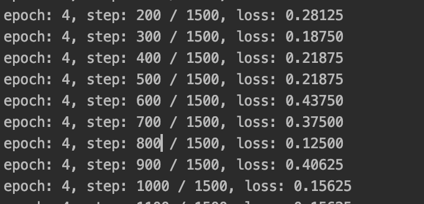

# cccnet

 CCCNet for HCY

It can be used though It isn't finished and I'll try my best to complete it tomorrow

1.Run train.py 

 todo list

- [ ] Saving model once every 10 epoches，then do an validate dateset test and record the test error rate
- [ ] loss and validate test error Graph need to be written into tensorflow board
- [ ] The network structure need to be saved into tensorflow board and be showed
- [ ] Improve the Network structure 