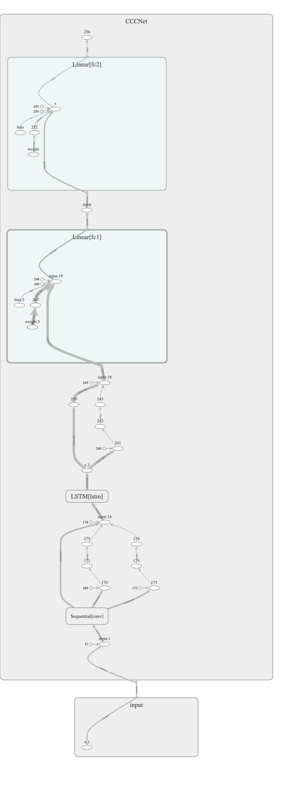
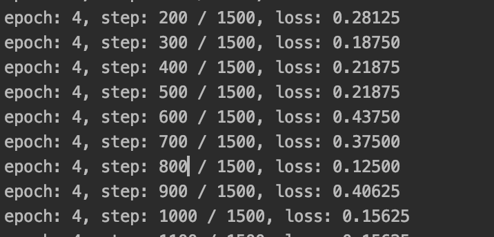

# cccnet

 CCCNet for HCY

## Result 

V 0.1.1-crossEntropy loss function

v 0.0.1  Accuracy is always 0.75...., the network structure nee to be improved.....

## Details

It can be used though It isn't finished and I'll try my best to complete it tomorrow

v0.0.1 CCCNet Structure

1.Run train.py 

 todo list

- [x] Saving model once every 10 epoches，then do an validate dateset test and record the test error rate
- [x] loss and validate test error Graph need to be written into tensorflow board
- [x] The network structure need to be saved into tensorflow board and be showed
- [ ] Improve the Network structure （hard.....）